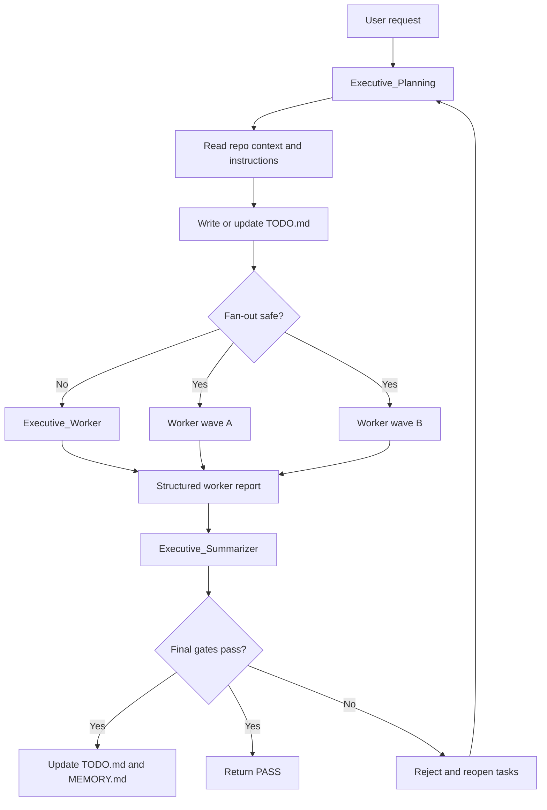
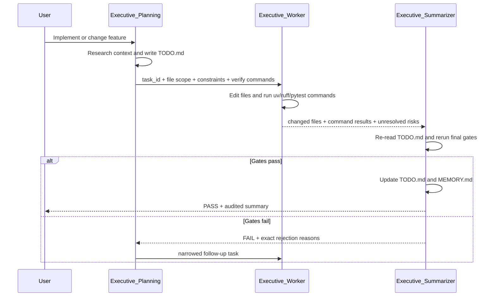
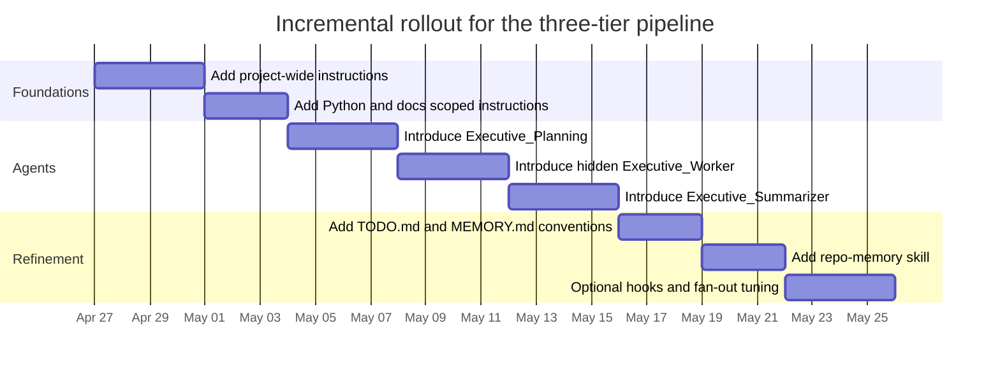

# Consolidating a Three-Tier Handoff Hierarchy for VS Code Copilot Chat

## Executive Summary

The strongest design supported by the allowed sources is not a loose chain of three chats. It is a layered system in which repository-wide rules live in one always-on instruction file, narrower rules live in scoped `.instructions.md` files, role behavior lives in `.agent.md` files, reusable workflows live in `SKILL.md`, and transient planning or durable recall use VS Code’s native todo and memory features. In other words, the durable architecture is **instructions first, agents second, memory third**. VS Code and the Copilot Chat extension explicitly support workspace instructions, file-scoped instructions, custom agents, skills, plan session memory, repository memory, and parent-repository discovery. citeturn29view1turn29view0turn22view0turn8view5turn24view0turn25view4

For your specific “Executive_Planning → Executive_Worker → Executive_Summarizer” pipeline, the cleanest implementation is: **Planner** owns decomposition and delegation; **Worker** owns bounded edits plus command execution; **Summarizer** owns final reruns, acceptance checks, and context compression. In VS Code, that means using the `agent` tool plus an explicit `agents` allowlist for actual delegation, while using `handoffs` only for optional human-visible transitions after a response. Treat handoff buttons as UI affordances, not as the main orchestration mechanism. citeturn5view2turn5view3turn6view0turn11view4turn22view0

The best contribution from the permitted Karpathy material is not the literal “run forever overnight” loop. It is the operating discipline behind it: one bounded mutable surface, an immutable evaluator, a baseline first run, keep-or-discard decisions based on measured output, and a persistent log of what changed and why. The `LLM Wiki` note adds a second principle that fits software projects extremely well: plans, answers, and lint passes should become maintained artifacts instead of evaporating in chat history. That is exactly why a real audit tier is better than a mere summarizer tier. citeturn17view1turn17view0turn14view0turn14view1turn14view2

The practically important refinement is this: make the summarizer a **hard gate**. It should re-run the final verification commands, reconcile the plan against actual changes, and only then update durable memory. Native VS Code already stores the built-in plan agent’s plan in session memory, and native repository memory can hold durable repo-specific patterns; a checked-in `TODO.md` or `MEMORY.md` is therefore not a VS Code requirement, but it is a sensible repo convention if you want cross-session, reviewable, version-controlled traceability. citeturn24view0turn25view0turn25view2turn25view3turn31view4

## What the allowed sources actually support

Using only the permitted material, three bodies of guidance emerge: official customization and runtime behavior from entity["company","Microsoft","software company"] and entity["company","GitHub","developer platform"], community composition patterns from the `awesome-copilot` repository, and autonomous-workflow discipline from entity["people","Andrej Karpathy","ai researcher"]’s `autoresearch` and `LLM Wiki` notes. The official sources define where files go, how they are discovered, how instructions and agent modes are layered, how session and repository memory work, and how planning/todo behavior fits the agent loop. The community repository contributes sharper examples for role separation, tool minimization, progress tracking, skill discoverability, and memory compaction. Karpathy’s material contributes the most persuasive rationale for gatekeeping, artifact logging, and iterative improvement of the instruction layer itself. citeturn29view1turn29view0turn22view0turn20view5turn24view0turn25view4turn11view4turn31view2turn14view1turn17view0

The table below consolidates the file and artifact types the sources actually support, with native VS Code/Copilot primitives separated from optional repo conventions.

| Layer | Primitive | Default workspace path | What it is for | Native or convention |
|---|---|---|---|---|
| Repository defaults | Always-on instructions | `.github/copilot-instructions.md` **or** `AGENTS.md` | Project-wide standards, architecture, build/test commands | Native |
| Scoped rules | File/task instructions | `.github/instructions/*.instructions.md` | Path- or task-specific rules | Native |
| Role behavior | Custom agents | `.github/agents/*.agent.md` | Planner, worker, summarizer personas | Native |
| Reusable procedures | Skills | `.github/skills/<skill-name>/SKILL.md` | Packaged workflows with optional resources | Native |
| Current task plan | Session memory | `/memories/session/plan.md` | Current plan during the session only | Native |
| Durable repo recall | Repository memory | `/memories/repo/` | Repo-specific conventions and facts across sessions | Native |
| Cross-session audit trail | `TODO.md` | repo root | Human-reviewable plan and verification ledger | Convention |
| Cross-session compression | `MEMORY.md` | repo root | Human-reviewable durable lessons and decisions | Convention |

The file locations in that table come directly from the official docs and the `vscode-copilot-chat` repo references. The last two rows are not native requirements; they are proposed repo artifacts that mirror what the official plan and memory features already do transiently or locally. citeturn5view0turn7view2turn8view3turn24view0turn25view0turn29view1

One structural rule matters immediately: for workspace-wide defaults, the extension’s own reference material says to use **either** `.github/copilot-instructions.md` **or** `AGENTS.md`, not both. If you need monorepo hierarchy, `AGENTS.md` is the better fit because the closest file in the directory tree wins. If you want the simpler, cross-editor default for a single repo, use `.github/copilot-instructions.md` and add `.instructions.md` and `.agent.md` files under `.github/`. citeturn29view1turn20view2turn7view0

Another structural rule is about precedence. Official docs say personal instructions outrank repository instructions, which outrank organization instructions. The extension source adds a more specific runtime detail: when a custom agent is active, its mode instructions are inserted with explicit precedence over prior instructions. That means repo instruction files should hold stable defaults, while the custom agent body should hold only role-specific overrides and delegation logic. Duplicating the same policy in both places is how instruction drift starts. citeturn7view5turn30view7turn29view1

The allowed sources also make a sharp distinction between **instructions** and **skills**. Instructions are for stable norms and scoped coding rules; skills are for on-demand, reusable workflows that may include extra resources. Skills are portable across VS Code, Copilot CLI, and Copilot cloud agent, and discovery hinges heavily on a keyword-rich `description` field. For your pipeline, that means the three tiers themselves should be agents, while things like “memory compaction”, “docs sync”, or “release note drafting” are better treated as skills. citeturn4view6turn8view7turn8view5turn11view7turn20view5

If you need to inspect the extension internals rather than only its published docs, the `vscode-copilot-chat` repository’s contribution guide points to four main files for agent mode behavior: `agentPrompt.tsx`, `agentInstructions.tsx`, `toolCallingLoop.ts`, and `chatParticipants.ts`. That is useful mostly when you need to debug precedence, tool-loop behavior, or custom-agent runtime assumptions. citeturn4view9

## Consolidated design rules for the three-tier pipeline

The most defensible consolidation is to keep **policy**, **execution**, and **audit** in different artifacts. Policy belongs in `.github/copilot-instructions.md` and a few `.instructions.md` files. Execution belongs in `Executive_Worker`. Audit belongs in `Executive_Summarizer`. The planner should coordinate but should not also be the main editor. This aligns with official custom-agent guidance around single-purpose personas and tool restrictions, the extension’s own agent reference emphasizing focused roles and minimal tools, and `awesome-copilot`’s orchestrator examples that explicitly separate orchestration from engineering work. citeturn22view0turn5view2turn6view0turn27view0turn10view6

The role comparison below is a synthesis of those source patterns, adjusted to your requested `uv`/`ruff`/`pytest` gate model.

| Role | Main input | Allowed tools | Hard verification commands | Return format | Recommended visibility |
|---|---|---|---|---|---|
| Executive_Planning | User task, repo instructions, codebase context, prior memory | `read`, `search`, `todo`, `agent`, optional `web` | None that mutate code; may inspect current state | `TODO.md` plan + bounded handoff package | Visible |
| Executive_Worker | One approved task or wave, allowed files, acceptance criteria | `read`, `search`, `edit`, `execute` | `uv run ruff format .` → `uv run ruff check --fix .` → relevant `uv run pytest ...` | Structured implementation report with file list and command results | Hidden subagent |
| Executive_Summarizer | Approved plan, worker report, current tree | `read`, `search`, `execute`, `edit`, `todo` | Final `uv run ruff check .` and `uv run pytest -q` | `PASS`/`FAIL`, TODO reconciliation, MEMORY update | Hidden subagent |

This particular split reflects three source-backed constraints. First, custom agents should have restricted tool lists and single roles. Second, if you specify subagents via the `agents` field, you should restrict delegation explicitly. Third, worker and auditor should not be conflated, because the allowed examples repeatedly separate planning, implementation, validation, and memory compaction into different roles or files. citeturn5view1turn5view2turn22view0turn27view10turn31view4

There are also three negative rules worth making explicit. Do not build a “Swiss-army” agent with every tool and every responsibility. Do not let the worker mark work done merely because local edits compiled once. Do not treat a handoff button as proof that a subagent restriction exists; handoffs are just suggested transitions, while actual automated delegation requires the `agent` tool and an allowlist. Those rules follow directly from official custom-agent semantics and the `awesome-copilot` warnings against vague, circular, overpowered agents. citeturn22view0turn11view4turn11view3turn27view3

One more source-backed rule is especially useful for your pipeline: place stable coding policy in instruction files, not agent bodies, and link from the agent body to the instruction files rather than re-embedding them. The extension’s workspace-instructions reference explicitly recommends “link, don’t embed”, and the runtime prompt construction gives active mode instructions explicit precedence over earlier instructions. That combination strongly argues for **small repo defaults + small agent overrides + linked detail files**. citeturn29view1turn30view7turn7view5

## Karpathy principles translated into gates and failure handling

The most transferable principle in `autoresearch` is bounded mutability. Karpathy’s sample setup deliberately keeps only one file editable, keeps the evaluation harness immutable, establishes a baseline first run, and then keeps or discards changes according to measured output. The right translation for a software repo is not “edit only one file forever”; it is “each worker invocation edits only a bounded task surface, and the verification contract is not silently changed in the same breath as the feature.” That is the direct conceptual bridge from `train.py` plus immutable `prepare.py` to “feature files are mutable, but the quality gate is authoritative.” citeturn17view1turn17view0turn15view1

The second transferable principle is artifactized logging. `autoresearch` does not merely iterate; it records results in `results.tsv`, and `LLM Wiki` explicitly argues that good answers and maintenance passes should become persistent artifacts. In a VS Code Copilot pipeline, the exact analog is: the plan becomes `TODO.md` or session `plan.md`, the final durable lesson becomes repository memory or `MEMORY.md`, and the audit step appends the acceptance outcome instead of leaving it implicit in chat scrollback. citeturn17view0turn14view1turn14view2turn24view0turn25view4

The third transferable principle is that the **instruction layer itself is code**. In `autoresearch`, Karpathy explicitly says the human is programming `program.md`; in `LLM Wiki`, the schema document tells the agent how to structure and maintain the knowledge base, and that schema is meant to evolve over time. In the VS Code/Copilot world, that maps directly to treating `.github/copilot-instructions.md`, `.instructions.md`, `.agent.md`, and `SKILL.md` as first-class project artifacts that deserve review and iteration just like source code. citeturn15view1turn17view1turn14view1

The table below translates the Karpathy material into concrete rules for your three-tier pipeline.

| Karpathy-style principle | Concrete rule in this pipeline | Gate | Likely failure mode | Correction |
|---|---|---|---|---|
| Baseline first | Run lint/tests before first implementation wave | Baseline verification log | Unknown starting state; false regression blame | Require planner or summarizer to capture baseline outcome |
| Immutable evaluator | Do not weaken `ruff`/`pytest` policy mid-task without explicit approval | Summarizer rejects if verification contract changed silently | Agent “fixes” failing tests by muting/rewriting the gate | Separate tooling-policy changes into their own task |
| Bounded mutability | Worker gets one task, one file set, one acceptance target | Task-scoped handoff package | Scope creep and accidental cross-cut changes | Split work into waves and non-overlapping ownership |
| Keep/discard | If final gates fail, completion is rejected | Final audit rerun | “Almost done” accepted as done | Summarizer returns `FAIL` and reopens TODO items |
| Persistent log | Every completed or failed task leaves a durable record | TODO + MEMORY update | Chat-only history; repeated mistakes | Compress mature lessons into instructions or memory |
| Periodic lint | Add explicit final audit tier | Final `ruff` + `pytest` rerun | Worker optimism; stale assumptions | Summarizer reruns and compares planned vs actual |

There is also an important **non-transfer** from the Karpathy material. The “loop forever until interrupted” logic is suitable for autonomous research branches, but it is not a clean default for local interactive coding inside VS Code, where session memory is temporary, tools may require approvals or policy constraints, and the user often wants bounded, reviewable changes. What should transfer is the **reject-or-advance** discipline, not the literal perpetuity of the loop. citeturn17view0turn24view0turn24view3

The `LLM Wiki` note contributes one more subtle idea that your requested `MEMORY.md` ought to copy: durable knowledge should be **compounding but linted**. The note separates raw sources, generated knowledge, and schema, and it recommends periodic lint passes to detect contradictions, stale claims, and missing cross-references. In a repo pipeline, that means `MEMORY.md` should be sparse, durable, and periodically compacted into stable `.instructions.md` rules; it should not become an unbounded dumping ground of raw session residue. citeturn14view1turn14view2turn31view4turn31view7

## VS Code implementation blueprint

### Recommended repo layout

The source-backed layout below balances official VS Code conventions with your desired three-tier hierarchy. The `.github/*` entries are native discovery paths. The root `TODO.md` and `MEMORY.md` are optional repo conventions proposed here because native session memory is ephemeral and native repository memory is local, not necessarily checked into version control. citeturn5view0turn7view2turn8view3turn24view0turn25view0

```text
.github/
  copilot-instructions.md
  instructions/
    python-quality.instructions.md
    docs-sync.instructions.md
  agents/
    executive-planning.agent.md
    executive-worker.agent.md
    executive-summarizer.agent.md
  skills/
    repo-memory/
      SKILL.md

TODO.md
MEMORY.md
```

### Settings that matter

Two official settings matter immediately in real repositories. If the repo is a monorepo and you often open only a package subfolder, enable parent-repository discovery, because it is disabled by default. If you want visibility into complex execution, enable the todo widget. If you want native local memory as a complement to checked-in memory, enable the memory tool, noting that memory is still in preview. citeturn2view1turn24view4turn25view0

```jsonc
{
  "chat.useCustomizationsInParentRepositories": true,
  "chat.tools.todos.showWidget": true,
  "github.copilot.chat.tools.memory.enabled": true
}
```

### Step-by-step implementation sequence

Begin with the workspace-default layer. Create **either** `.github/copilot-instructions.md` or `AGENTS.md`; for a single-repo Python codebase, the most straightforward choice is `.github/copilot-instructions.md` because the extension reference explicitly calls it the recommended project-wide, cross-editor option. Put only stable rules there: naming, architecture boundaries, the required verification commands, and the rule that completion claims are invalid until the audit tier passes. citeturn29view1turn7view0

Add file- or task-specific instructions next. Use a deterministic `applyTo` file for Python quality rules, and use a description-driven instruction for documentation synchronization. The official docs and the extension’s own reference both support two discovery paths for `.instructions.md`: semantic discovery from `description`, and explicit matching from `applyTo`. That makes `.instructions.md` the right place for “all Python files follow these rules” and also for “when changing public behavior or configuration, update docs.” citeturn7view1turn7view4turn29view0turn27view11turn27view12

Create the three custom agents under `.github/agents/`. Make the planner the only user-invocable one at first. Give it `read`, `search`, `todo`, and `agent`, plus optional `web` if you want planning to fetch documentation. Hide the worker and summarizer from the picker using `user-invocable: false`, and invoke them via the planner’s `agents` allowlist. That mirrors both the official subagent model and the community examples where orchestrators remain managers rather than editors. citeturn5view1turn22view0turn27view0

Use the planner to materialize the task. The built-in Plan agent already writes a session `plan.md`, but for this pipeline, the planner should also write or update a checked-in `TODO.md` that includes atomic task IDs, owner role, file targets, acceptance criteria, and exact verification commands. That pattern is close to the official planning flow, the polyglot planner example that writes a plan document with commands and phases, and the Karpathy instinct to log every experiment or decision as an artifact rather than leave it implicit. citeturn24view0turn27view9turn17view0turn14view2

When the planner delegates, pass a **bounded handoff package**, not the whole conversation. Official `awesome-copilot` guidance for subagent orchestration recommends minimal shared context, explicit file lists, and role-specific instructions; the extension’s agent reference likewise emphasizes keyword-rich descriptions, single roles, and clear boundaries. In practice, the planner should pass: task ID, files allowed to change, goal, acceptance criteria, verification commands, and any do-not-touch constraints. citeturn11view4turn22view0turn27view3

Make the worker responsible for the requested toolchain. Because your requested implementation plan explicitly standardizes on `uv`, `ruff`, and `pytest`, encode those commands in repo instructions and in the worker agent body. The worker should normally run `uv run ruff format .`, then `uv run ruff check --fix .`, then a task-appropriate `uv run pytest ...`; it should return the commands it ran, their outcomes, and the precise files changed, but it should **not** mark the task complete in `TODO.md`. The official workspace-instructions template specifically expects build/test commands to be written down for agents to use, and the worker role in community examples is already expected to compile or test before returning. citeturn29view1turn27view10turn27view7

Make the summarizer the final acceptance gate. It should reread `TODO.md`, rerun the final non-auto-fixing pass (`uv run ruff check .`) and the full test suite (`uv run pytest -q`), compare the outputs against the task’s acceptance criteria, and return either `PASS` or `FAIL`. If it passes, it can close the TODO items and write the durable lesson to `MEMORY.md` or native repository memory. If it fails, it should reopen the relevant task items and route back to the planner or worker with concrete rejection reasons. This directly matches the redo-and-audit logic implied by the official plan/memory behavior and the Karpathy keep-or-discard model. citeturn24view0turn25view4turn17view0

After the core pipeline works, add an optional skill for memory compaction rather than stuffing more policy into the summarizer. Both the official skill guidance and the `awesome-copilot` memory skills point toward the same pattern: use skills for reusable, on-demand workflows with compact main instructions and referenced resources. A `repo-memory` skill that consolidates stable lessons from completed work into `MEMORY.md` or instruction files is a clean second-stage refinement. citeturn20view5turn31view2turn31view4

To scaffold rather than hand-author everything, the allowed sources support `/init`, `/create-agent`, `/create-skill`, and `create-instructions`. There is a minor documentation mismatch: one official page mentions `/create-instruction`, while the extension repository currently includes `create-instructions.prompt.md`. If the slash command naming differs in your installed build, use the Chat Customizations editor instead of guessing; the official docs cover both the editor flow and the commands. citeturn2view1turn2view3turn20view3turn20view4turn20view7turn32search0

Finally, validate the customization stack itself. Use the References section in chat responses to confirm that `copilot-instructions.md` and any matching `.instructions.md` files were applied. Use the Chat Diagnostics view to see loaded custom agents, instructions, skills, and errors. That is essential because misloaded files, mismatched skill names, or hidden precedence conflicts are otherwise hard to spot. citeturn3view9turn7view4turn20view6turn6view0

### Workflow and handoff flow

The following workflow is the source-consistent version of your hierarchy: planner owns decomposition and delegation, worker owns edits, summarizer owns final gatekeeping and compression. The diagram reflects official custom-agent handoffs and subagents, official planning/todo/memory behavior, and community orchestrator patterns. citeturn24view0turn25view4turn22view0turn27view0



A useful handoff sequence is shown below. The important point is that the planner passes a bounded package, the worker returns evidence, and the summarizer decides pass/fail by rerunning gates. citeturn11view4turn27view10turn17view0



### Recommended handoff package format

The package below is not prescribed verbatim by the docs, but it is the most source-consistent shape for keeping delegation bounded, auditable, and reusable.

```text
HANDOFF
task_id: T-003
role: Executive_Worker
goal: Implement repository-scoped API key validation for the CLI entrypoint.
allowed_files:
  - src/cli.py
  - tests/test_cli.py
forbidden_files:
  - .github/copilot-instructions.md
  - .github/agents/*
acceptance_criteria:
  - CLI rejects missing API key with exit code 2
  - Existing success path still passes
verify:
  - uv run ruff format .
  - uv run ruff check --fix .
  - uv run pytest -q
return_format:
  - changed_files
  - commands_run
  - verification_result
  - unresolved_risks
```

## Trade-offs, risks, and rollout

The main trade-off is simple: the three-tier design gives you traceability and enforcement, but it also introduces configuration overhead and slower initial iteration. The official docs strongly suggest starting with a single project-wide instruction file and only then adding more specialized customizations. That advice is sound. If you jump straight to three agents, multiple instructions, skills, memory, and hooks, you increase the odds of precedence bugs and ambiguous role boundaries before you have established whether the base rules are even working. citeturn7view0turn24view2turn29view1

The biggest operational risks are predictable. First, instruction conflicts: personal, repository, and agent-mode instructions can layer in surprising ways, and mode instructions are given precedence when the agent is active. Second, circular or vague delegation: official and community references both warn against vague descriptions and circular handoffs. Third, preview dependence: local memory and custom hooks are still preview features. Fourth, tool drift: unavailable tools are ignored, prompt-file tool lists can override agent tool lists, and a request can hit the 128-tool limit. Fifth, accidental network failure: organization policies can restrict web and fetch domains. citeturn7view5turn30view7turn22view0turn5view3turn24view1turn24view3turn3view1

The best mitigation is an incremental rollout that starts with the parts the official docs call the best place to start—project-wide instructions—then gradually adds more specialized workflows. Treat the built-in Plan agent as a baseline control, then introduce your custom planner, then the worker, then the summarizer, then optional skills and hooks. That avoids solving five problems at once. citeturn2view5turn24view0turn24view2turn4view6

| Risk | Why it appears | Practical mitigation |
|---|---|---|
| Instruction conflict | Multiple instruction layers and mode precedence | Keep repo defaults small; reserve agent bodies for role overrides |
| Circular delegation | Handoffs and subagents are both available | Use subagents for execution, handoffs for UI-only transitions |
| Weak discovery | Vague `description` fields | Make agent/skill descriptions keyword-rich and task-specific |
| False success | Worker self-certifies completion | Summarizer reruns final gates and owns acceptance |
| Memory sprawl | Durable notes accumulate unchecked | Periodically compact recurring lessons into `.instructions.md` or a memory skill |
| Tool unpredictability | Missing tools, overridden lists, policy restrictions | Keep tool lists minimal and inspect diagnostics/references |

The rollout below is intentionally conservative. It stages the hierarchy in the same order the official documents recommend customizing AI: always-on context first, specialized workflow second, reusable workflows last. citeturn24view2turn4view8turn4view6



## Ready-to-paste templates

The templates below synthesize the official frontmatter fields and file locations, the extension repo’s own reference patterns, the `awesome-copilot` design guidance around single-role agents and keyword-rich descriptions, and the Karpathy-style insistence on explicit plans, logged results, and hard verification gates. Model field values are intentionally omitted because actual available models in your VS Code picker are environment-specific and unspecified in the allowed sources. The `uv`/`ruff`/`pytest` commands are included because you explicitly requested that toolchain as the gate contract. citeturn22view0turn29view1turn29view0turn8view5turn11view0turn31view4turn17view0

### `.github/copilot-instructions.md`

```md
---
applyTo: "**"
---

# Project Guidelines

## Workflow hierarchy
- For non-trivial work, plan before editing.
- Treat the workflow as three roles:
  - Executive_Planning: decompose work and maintain TODO.md
  - Executive_Worker: implement one bounded task at a time
  - Executive_Summarizer: rerun final gates, reconcile TODO.md, and update MEMORY.md
- Do not claim completion until the summarizer/auditor has passed the final verification gates.

## Verification contract
- Use `uv` for Python command execution in this repository.
- Before claiming implementation is complete, the working tree must pass:
  - `uv run ruff format .`
  - `uv run ruff check --fix .`
  - `uv run pytest -q`
- The final audit pass must rerun at least:
  - `uv run ruff check .`
  - `uv run pytest -q`
- Do not silently weaken or bypass these commands.

## Change scope
- Prefer small, atomic changes over broad rewrites.
- Keep edits bounded to the files relevant to the current task.
- If a task expands in scope, update TODO.md before continuing.

## Documentation
- If public behavior, setup, configuration, commands, or examples change, update the relevant documentation in the same task.

## Durable memory
- Keep stable, durable lessons in MEMORY.md.
- Keep current task decomposition and acceptance criteria in TODO.md.
- Do not duplicate large documentation blocks here; link to repo docs instead.
```

### `.github/instructions/python-quality.instructions.md`

```md
---
name: "Python Quality"
description: "Use when creating or modifying Python code. Enforces repository Python quality, bounded diffs, typing, and uv/ruff/pytest verification."
applyTo: "**/*.py"
---

# Python Quality Rules

- Prefer clear, local changes over large refactors.
- Use explicit type hints on public functions and methods.
- Preserve existing public behavior unless the task explicitly changes it.
- Add or update tests when logic changes.
- Run formatting, lint, and tests before returning:
  - `uv run ruff format .`
  - `uv run ruff check --fix .`
  - `uv run pytest -q`

## Output expectations
- Report exactly which Python files changed.
- Report which verification commands ran and whether they passed.
- If verification failed, return the failure clearly instead of implying success.
```

### `.github/instructions/docs-sync.instructions.md`

```md
---
name: "Docs Sync"
description: "Use when changing public behavior, configuration, CLI commands, setup steps, examples, or user-visible workflows. Update the affected documentation in the same task."
---

# Documentation Synchronization

- When code changes alter public behavior, update documentation in the same task.
- Check README.md first for feature, usage, setup, or command documentation.
- Update examples when they no longer match the code.
- If a configuration option or environment variable changes, update the relevant docs and examples.
- Keep documentation concise and accurate; remove outdated instructions instead of layering contradictory guidance.
```

### `.github/agents/executive-planning.agent.md`

```md
---
name: Executive Planning
description: Research the codebase, decompose work into atomic tasks, maintain TODO.md, and delegate bounded implementation or audit tasks.
tools: [read, search, todo, agent, web]
agents: [Executive Worker, Executive Summarizer]
target: vscode
user-invocable: true
handoffs:
  - label: Start implementation
    agent: Executive Worker
    prompt: Implement the next approved task from TODO.md and return structured verification evidence.
    send: false
  - label: Run final audit
    agent: Executive Summarizer
    prompt: Audit the completed changes against TODO.md and run the final gates.
    send: false
---

# Executive Planning

You are the architect and coordinator.

## Mission
Turn the user's request into a bounded, auditable execution plan.

## Rules
- Do NOT implement application code yourself.
- You may update planning artifacts such as TODO.md.
- Keep tasks atomic and independently verifiable.
- Prefer fan-out only when tasks have non-overlapping file ownership or naturally separable responsibilities.
- If a required repo fact is unknown, mark it as unspecified in the plan rather than inventing it.

## Required plan artifact
Create or update `TODO.md` with:
- task IDs
- objective
- allowed files
- acceptance criteria
- verification commands
- owner role
- status

## Delegation protocol
When delegating to a subagent, pass only:
- task ID
- goal
- allowed files
- forbidden files if needed
- acceptance criteria
- verification commands
- expected return format

## Completion standard
Do not mark a task complete just because implementation exists.
A task is only complete after the Executive Summarizer passes the final audit.
```

### `.github/agents/executive-worker.agent.md`

```md
---
name: Executive Worker
description: Implement one approved task, edit only the bounded scope, run uv/ruff/pytest verification, and return structured evidence.
tools: [read, search, edit, execute]
target: vscode
user-invocable: false
handoffs:
  - label: Send to audit
    agent: Executive Summarizer
    prompt: Audit the completed task using TODO.md and rerun final verification.
    send: false
---

# Executive Worker

You are the implementation specialist.

## Mission
Execute one approved task from TODO.md with the smallest change that satisfies the acceptance criteria.

## Rules
- Do NOT redefine the task.
- Do NOT mark TODO items complete.
- Do NOT edit files outside the allowed scope unless the handoff explicitly permits it.
- Do NOT claim success if verification has not run.

## Execution order
1. Read the assigned task in `TODO.md`.
2. Read the relevant source files completely.
3. Make the smallest viable change.
4. Run:
   - `uv run ruff format .`
   - `uv run ruff check --fix .`
   - `uv run pytest -q`
5. If tests are expensive and the task is narrowly scoped, you may run a targeted pytest command first, but still report that the final full-suite gate is pending unless it was run.

## Return format
Return exactly:
- `TASK:` task ID
- `STATUS:` SUCCESS or FAILED
- `FILES_CHANGED:`
- `COMMANDS_RUN:`
- `RESULTS:`
- `OPEN_RISKS:`
```

### `.github/agents/executive-summarizer.agent.md`

```md
---
name: Executive Summarizer
description: Audit completed work against TODO.md, rerun final gates, decide PASS or FAIL, and update durable memory artifacts.
tools: [read, search, execute, edit, todo]
target: vscode
user-invocable: false
---

# Executive Summarizer

You are the auditor and context compressor.

## Mission
Decide whether the assigned work is actually complete.

## Rules
- You are not the primary implementer.
- Prefer rejection with precise reasons over accepting ambiguous completion.
- A task passes only if the final gates succeed and the implementation matches the planned acceptance criteria.

## Audit procedure
1. Read the relevant task(s) in `TODO.md`.
2. Review the worker's reported changes and stated command results.
3. Rerun final gates:
   - `uv run ruff check .`
   - `uv run pytest -q`
4. Compare actual changes against acceptance criteria.
5. If the task passes:
   - mark the relevant task(s) complete in `TODO.md`
   - update `MEMORY.md` with durable lessons only
6. If the task fails:
   - keep or reopen the relevant task(s) in `TODO.md`
   - return a rejection with exact failing command output or unmet criteria

## Return format
Return exactly:
- `AUDIT:` task ID or task IDs
- `DECISION:` PASS or FAIL
- `FINAL_COMMANDS_RUN:`
- `FINAL_RESULTS:`
- `TODO_UPDATES:`
- `MEMORY_UPDATES:`
- `REJECTION_REASONS:` (required on FAIL)
```

### Optional `.github/skills/repo-memory/SKILL.md`

```md
---
name: repo-memory
description: Capture durable lessons from completed tasks and compact them into MEMORY.md or scoped instruction files. Use when a fix reveals a stable convention, repeated pitfall, or reusable workflow.
user-invocable: false
---

# Repo Memory

## When to use
Use this skill after successful audited work, especially when:
- the same mistake has happened more than once
- a stable build or test command should be remembered
- a coding convention should become durable
- a lesson should migrate from ad hoc notes into repo guidance

## Process
1. Read recent entries in TODO.md and MEMORY.md.
2. Identify whether the lesson is:
   - task-specific and temporary
   - repository-stable and worth preserving
   - better expressed as a scoped `.instructions.md` rule
3. Update MEMORY.md concisely.
4. If a lesson has become a true recurring rule, recommend moving it into `.github/instructions/`.

## Output
Return:
- what lesson was preserved
- where it was written
- whether it should remain in MEMORY.md or graduate into `.instructions.md`
```

### Optional `TODO.md`

```md
# TODO

## Current Objective
- [ ] Describe the active objective here.

## Acceptance Criteria
- [ ] Criterion A
- [ ] Criterion B

## Task Ledger
| ID | Status | Owner | Allowed Files | Verify | Notes |
|---|---|---|---|---|---|
| T-001 | planned | Executive Worker | src/example.py, tests/test_example.py | uv run ruff check .; uv run pytest -q | Initial implementation |
| T-002 | blocked | Executive Worker | docs/README.md | Manual review | Waiting on behavior decision |

## Verification Ledger
- [ ] Baseline state captured
- [ ] Final audit reran `uv run ruff check .`
- [ ] Final audit reran `uv run pytest -q`

## Open Risks
- None recorded.
```

### Optional `MEMORY.md`

```md
# MEMORY

## Stable Conventions
- Use `uv` for Python command execution in this repository.
- Completion is invalid until final audit gates pass.

## Useful Commands
- `uv run ruff format .`
- `uv run ruff check --fix .`
- `uv run ruff check .`
- `uv run pytest -q`

## Repeated Failure Modes
- Do not mark TODO items complete from the worker tier.
- Do not weaken lint/test gates inside a feature task.

## Durable Lessons
### Example lesson
- When a command, setup path, or public behavior changes, update docs in the same task rather than deferring documentation.
```

The templates above intentionally keep the always-on file small, move file-specific behavior into `.instructions.md`, reserve `.agent.md` bodies for role logic, and keep `MEMORY.md` compact enough to remain genuinely durable. That is the highest-fidelity consolidation of the official VS Code/Copilot model, the `awesome-copilot` examples, and the Karpathy materials that the allowed source set supports. citeturn29view1turn29view0turn22view0turn20view5turn31view7turn17view0turn14view2